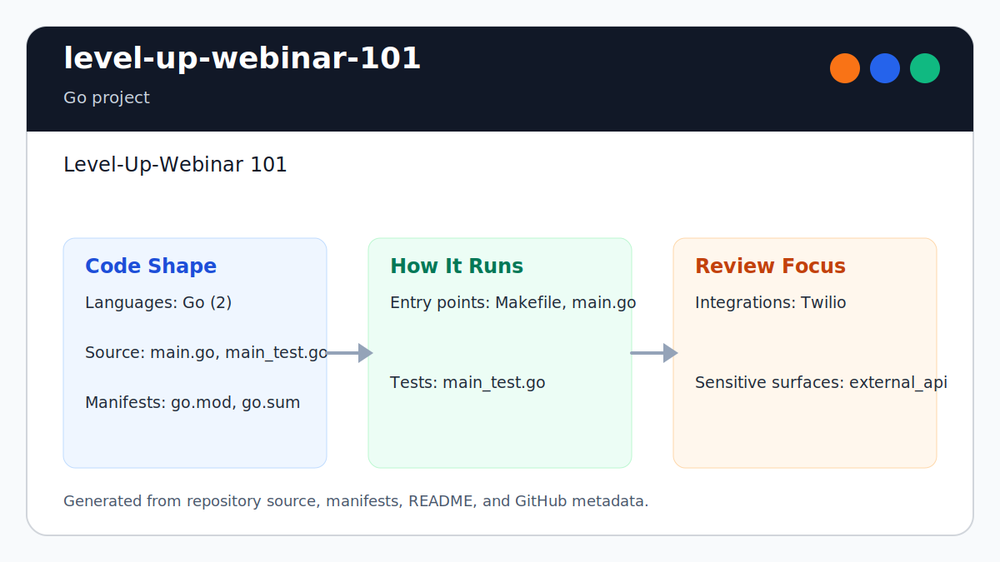

# level-up-webinar-101

<!-- README-OVERVIEW-IMAGE -->


## Overview

`garethpaul/level-up-webinar-101` is a Go project. Level-Up-Webinar 101

This README is based on the checked-in source, manifests, scripts, and repository metadata on the `main` branch. The project language mix found during review was: Go (1).

## Repository Contents

- `README.md` - project overview and local usage notes
- `SECURITY.md` - security reporting and disclosure guidance
- `VISION.md` - project direction and maintenance guardrails

Additional scan context:

- Source directories: no top-level source directories detected
- Dependency and build manifests: none detected
- Entry points or build surfaces: main.go
- Test-looking files: no obvious test files detected

## Getting Started

### Prerequisites

- Git

### Setup

```bash
git clone https://github.com/garethpaul/level-up-webinar-101.git
cd level-up-webinar-101
```

The setup commands above are derived from repository files. Legacy mobile, Python, or JavaScript samples may require older SDKs or package versions than a modern workstation uses by default.

## Running or Using the Project

- Run `go run .` or build the module with `go build ./...`.

## Testing and Verification

- No dedicated automated test command was identified from the checked-in files. Verify changes by running the relevant build or manually exercising the sample.

When the required SDK or runtime is unavailable, use static checks and source review first, then verify on a machine that has the matching platform toolchain.

## Configuration and Secrets

- Detected references to Twilio. Keep API keys, OAuth credentials, tokens, and account-specific values in local configuration only.

## Security and Privacy Notes

- Review changes touching external API calls or credential-adjacent configuration; examples from the scan include main.go.

## Maintenance Notes

- See `SECURITY.md` for vulnerability reporting and safe research guidance.
- See `VISION.md` for project direction and contribution guardrails.

## Contributing

Keep changes small and tied to the project that is already present in this repository. For code changes, document the toolchain used, avoid committing generated dependency directories or local configuration, and update this README when setup or verification steps change.

## Existing Project Notes

Prior README summary:

> level-up-webinar-101 <!-- README-OVERVIEW-IMAGE --> Level-Up-Webinar 101
